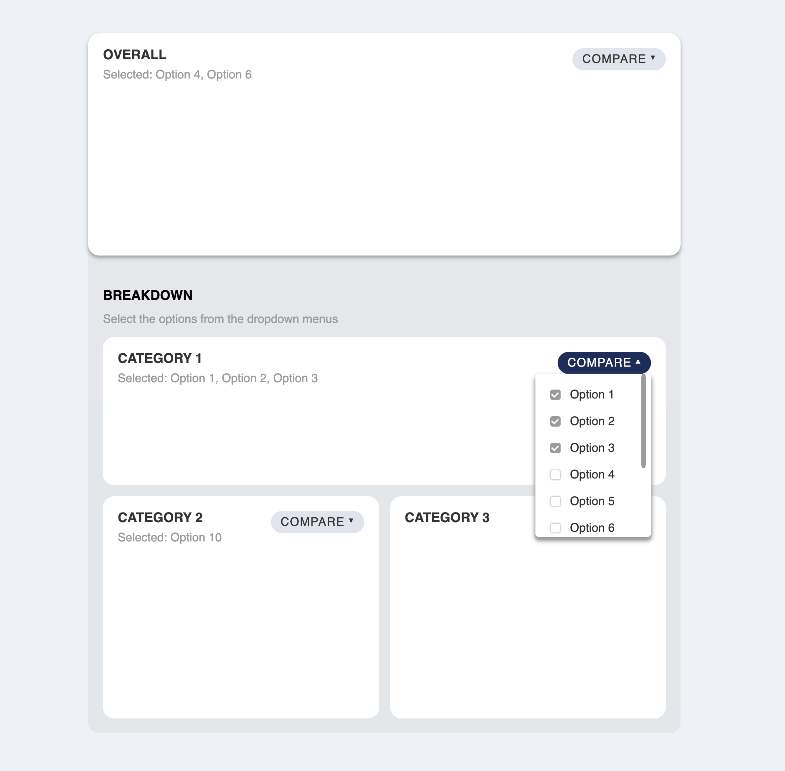

# Elm UI Dashboard



- [elm-ui](https://package.elm-lang.org/packages/mdgriffith/elm-ui/1.1.8/)

## Running the app

```sh
npm install -g create-elm-app
elm-app start
```

## Interaction requirements

- [x] There are 4 dropdown menus in the page one for each of the sections (the four sections are called: overall, category 1, category 2, and category 3)
- [x] Each dropdown has a list of options (~10), each of which can be selected and de-selected through a checkbox
- [x] Each dropdown can be opened by clicking on it
- [x] Clicking anywhere outside of the dropdown should close it
- [x] Selecting/deselecting a checkbox should not close the dropdown
- [x] Selected options should show as text in the respective section
- [x] Manually control responsive with `classifyDevice`! 📲
